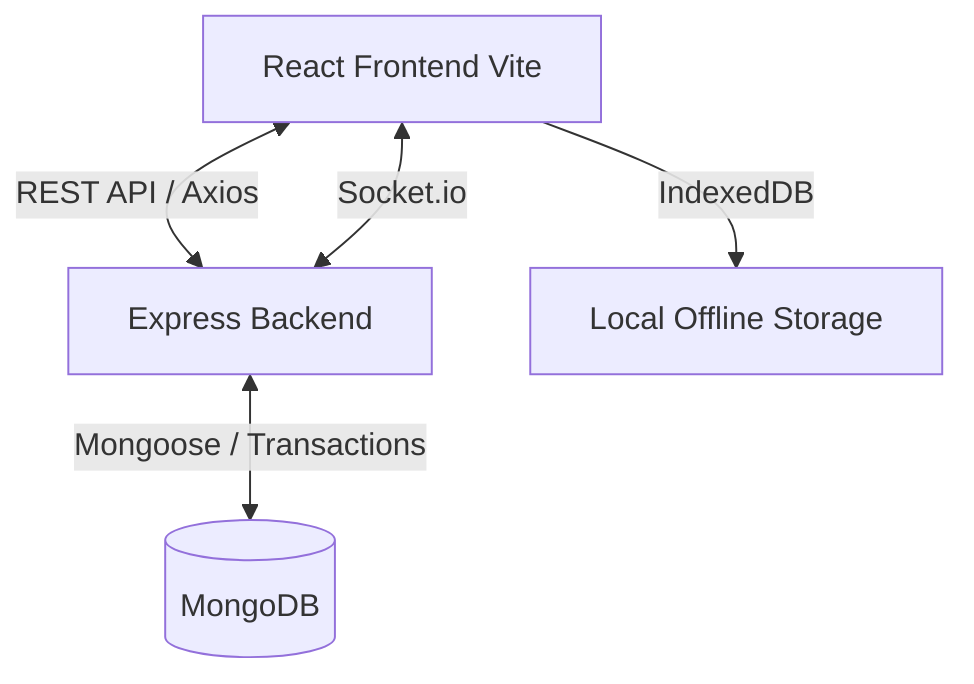

# Call Center System - Project Context

This document serves as the single source of truth for the Call Center System project. It is designed to help AI assistants (Claude, ChatGPT, Cursor, Windsurf, etc.) and human developers quickly understand the project's architecture, technology stack, business logic, and coding standards.

---

## 1. Project Overview

*   **Project Name:** Call Center System (Baseera)
*   **Purpose:** A comprehensive platform designed to manage call center operations, conduct dynamic surveys/interviews, and enforce quality control.
*   **Target Users:**
    *   **Agents:** Conduct surveys and fill out pre-call checklists.
    *   **Quality Control (QC):** Audit agent calls, perform live shadow reviews, and flag responses.
    *   **Admins:** Create campaigns, manage users, and view analytics.
*   **Main Features:**
    *   Dynamic Survey Builder with complex branching logic, composite questions (`multi_input`), and drag-and-drop (`@dnd-kit`).
    *   Agent Pre-Call Checklist for tracking logistics (e.g., governorate targeting, phone queues).
    *   Queue management, postponed target tracking, and "No Phone Required" (Auto-Serial) workflows.
    *   Agent workforce management (Timecard tracking via Status Logs, Profile Requests, SOP updates).
    *   Offline draft saving and synchronization.
    *   Live auditing, Shadow Review capabilities, and advanced analytics with `recharts`.
    *   Robust export capabilities (SPSS `.sav`, Excel).
*   **Current Development Stage:** Active Production with ongoing feature enhancements (e.g., recent addition of composite questions, `no_phone_required` modes, and E2E testing).

---

## 2. Technology Stack

### Frontend (`/admin-ui`)
*   **Framework:** React 19 (Single Page Application)
*   **Build Tool:** Vite
*   **Language:** JavaScript (ES6+)
*   **UI Library:** Custom CSS (`glass-card` aesthetics, modern UI), Lucide React (Icons).
*   **Animations:** Framer Motion
*   **State Management:** React Hooks (`useState`, `useContext`), Custom Hooks (`useAuth`, `useSurveyBuilderState`).
*   **Routing:** React Router DOM.
*   **API Communication:** Axios (wrapped in a custom `api` client), Socket.io-client for real-time updates.
*   **Storage:** LocalStorage (auth tokens), IndexedDB (`offlineDb.js`) for offline draft/response syncing.
*   **Testing:** Vitest for unit tests, Playwright for E2E tests.

### Backend
*   **Framework:** Express.js (Node.js)
*   **Language:** JavaScript (CommonJS)
*   **API Architecture:** RESTful APIs + Socket.io for real-time events (`stats-update`, etc.).
*   **Authentication:** JWT (JSON Web Tokens) stored in headers.
*   **Authorization:** Role-based middleware (`auth`, `adminAuth`, `agentActiveAuth`).
*   **Business Logic Organization:** Controller-Service-Model architecture. Fat services, thin controllers.
*   **Error Handling:** Custom `errorHandler` middleware.

### Database / Data Architecture
*   **Database Type:** MongoDB
*   **ORM:** Mongoose
*   **Schema Organization:** Modular schemas in the `/models` directory.
*   **Data Integrity:** Heavy use of transactions (`runTransaction` helper) for multi-document updates.
*   **Counters:** Custom `Counter.js` model for generating sequential, human-readable Serial Numbers.

---

## 3. System Architecture

*   **Overall Architecture:** Client-Server model. The React frontend (`admin-ui`) communicates with the Express backend via REST APIs.
*   **Real-time Flow:** Socket.io is used to broadcast statistical updates to connected clients (e.g., updating response counts in the Admin dashboard).
*   **Offline Flow:** Agents can work offline. The frontend attempts to save drafts/responses to the API; if it fails due to network issues, it falls back to IndexedDB. Upon reconnection, an offline sync process pushes data to the backend.
*   **Pre-Call to Survey Flow:**
    1.  Agent fetches a number from the queue (or auto-generates a serial via `no_phone_required` mode).
    2.  Agent completes the **PreCallChecklist** (creates a `PrecallCompletion` doc).
    3.  If qualified, the agent proceeds to the **Survey Questionnaire** (creates a `Draft` then a final `Response` doc).

---

## 4. Project Structure

*   **`/admin-ui/`**: The React frontend application workspace (built with Vite).
    *   `/src/components/`: Reusable UI components (`ConditionBuilder`, `FlagPopover`).
    *   `/src/pages/`: Main route views (`TakeSurvey`, `ResponseHistory`, `PreCallChecklist`).
    *   `/src/context/`: Global state providers (`AuthContext`, `UIContext`).
    *   `/src/hooks/`: Custom React hooks (`useOnlineStatus`, `useSurveyBuilderState`).
    *   `/src/utils/`: Frontend utilities (`offlineDb.js`, `translations.js`).
*   **`/models/`**: Mongoose database schemas.
*   **`/controllers/`**: Request handlers mapping HTTP requests to Service layer logic.
*   **`/routes/`**: Express route definitions (API endpoints).
*   **`/services/`**: Core business logic, keeping controllers clean (`agentService`, `precallService`).
*   **`/middleware/`**: Express middlewares (`auth.js`, `validation.js`, `errorHandler.js`).
*   **`/tests/`**: Jest integration and unit tests for the backend.
*   **`/utils/`**: Backend utilities (`logger.js`, `runTransaction.js`).
*   **`/scripts/`**: Maintenance scripts (e.g., database seeders and migrations).
*   **`/e2e/`**: Playwright End-to-End tests.

---

## 5. Development Workflow

*   **Environment Variables:** Configured via `.env` (refer to `.env.example`).
*   **Running Locally:**
    *   Backend: `npm run dev` (uses `nodemon`).
    *   Frontend: Navigate to `/admin-ui` and run `npm run dev` (starts Vite dev server).
*   **Testing:** 
    *   Backend: Comprehensive Jest test suite (`npm test`).
    *   Frontend: Vitest (`npm run test` in `/admin-ui`).
    *   E2E: Playwright tests available.
*   **Linting:** ESLint configured via `eslint.config.mjs`.
*   **Transactions:** When testing or developing, ensure a MongoDB Replica Set is running, as Mongoose transactions require it (handled automatically in Jest via MongoMemoryReplSet).

---

## 6. Key Data Models

*   **`User`**: System users (Agents, Admins, Quality). Tracks `currentStatus` (active, break, off-duty).
*   **`StatusLog`**: Timecard system tracking agent status switches (Active, Break) for accurate duration metrics.
*   **`Survey`**: Campaign configurations. Contains dynamic `questions`, branching `logic`, and `outboundPrecall` config.
*   **`PhoneNumber`**: The queue system. Maps phone numbers to campaigns and tracks their `status` (pending, called).
*   **`PostponedSerial`**: Tracks call targets marked as "Postponed" by the agent.
*   **`PrecallCompletion`**: Logs pre-survey logistics, caller disposition, and eligibility checks.
*   **`Draft`**: Auto-saving collection for in-progress surveys. Has a 7-day TTL index.
*   **`Response`**: Final submitted survey answers. Contains an array of `{ questionId, value }`.
*   **`Review`**: Quality assurance records. Tracks flags, shadow reviews, and audits linked to specific Responses.
*   **`OtherCoding`**: Diagnostic schema handling coding for "Other" responses.
*   **`ProfileRequest` & `SopUpdate`**: Workforce management utilities for agents.

---

## 7. Coding Standards

*   **Architecture:** Strictly follow Controller -> Service -> Model. Do not put heavy business logic in route files or controllers.
*   **Error Handling:** Use custom error objects (e.g., `throw createError('Message', 400)`) in services, and let the `errorHandler` middleware catch them.
*   **Transactions:** Any operation modifying multiple collections (e.g., completing a precall and updating a phone number status) MUST use the `runTransaction` utility.
*   **React:**
    *   Avoid direct DOM manipulation.
    *   Use optional chaining (`?.`) when dealing with deeply nested survey data.
    *   **Critical:** When rendering dynamic answers (especially from `multi_input` types), ensure the value is safely formatted to a string (e.g., using `formatCellValue`) to prevent React Error #31 crashes from raw objects.
*   **Localization:** The frontend supports English/Arabic via `translations.js` and the `t()` context function. Always wrap hardcoded text in `t('key') || 'Fallback'`.

---

## 8. AI Collaboration Rules

1.  **Do No Harm:** Never rewrite working code unnecessarily. Preserve existing architecture and styling paradigms.
2.  **Transactions First:** If adding a feature that creates/updates multiple database records, ALWAYS wrap it in `runTransaction`.
3.  **Data Safety:** When modifying Frontend UI to display database fields, defensively check for `null`, `undefined`, or unexpected types (like objects where strings are expected).
4.  **No Global Assumptions:** Do not hardcode business logic based on specific field names (e.g., assuming "Age" always exists). Use dynamic survey configurations.
5.  **Offline Compatibility:** When adding features to the agent survey flow, ensure they degrade gracefully or queue gracefully when `isOnline` is false.
6.  **Explain Before Execution:** When planning architectural changes, explicitly state the files you intend to touch and how they interact.

---

## 9. Current Progress & Recent Fixes

*   **Implemented:**
    *   "No Phone Required" mode: Auto-generates serials for field agents, bypassing phone queues.
    *   Composite Questions (`multi_input`): Allows grouping multiple inputs under one question ID.
    *   Agent workforce models (`StatusLog`, `SopUpdate`).
    *   SPSS and Excel export functionality (`sav-writer`, `exceljs`).
*   **Recent Fixes:**
    *   Removed hardcoded under-18 age gates. Eligibility is now purely based on dynamic call outcomes and survey logic.
    *   Fixed React Error #31 crashes across `ResponseHistory`, `TakeSurvey`, and `ShadowReview` by safely stringifying object values from `multi_input` answers.
*   **Technical Debt:**
    *   Need to continually ensure that frontend UI components don't assume `ans.value` is always a primitive string (due to composite questions).

---

## 10. Notes for Future AI Sessions

*   **The Pre-call vs. Survey boundary:** The system has a strict two-phase process. Phase 1 is the `PreCallChecklist` (creates `PrecallCompletion`), which acts as a gatekeeper. Phase 2 is `TakeSurvey` (creates `Response`).
*   **State Management:** The Survey Builder is notoriously complex. If editing `TakeSurvey.jsx` or `PreCallChecklist.jsx`, pay close attention to `useEffect` dependency arrays to avoid infinite loops with `answers` state.
*   **Mock Phone Numbers:** When using `no_phone_required` mode, the backend generates a dummy phone number format: `AUTO-{serialNumber}`. This satisfies database uniqueness and legacy requirements without breaking charts.
